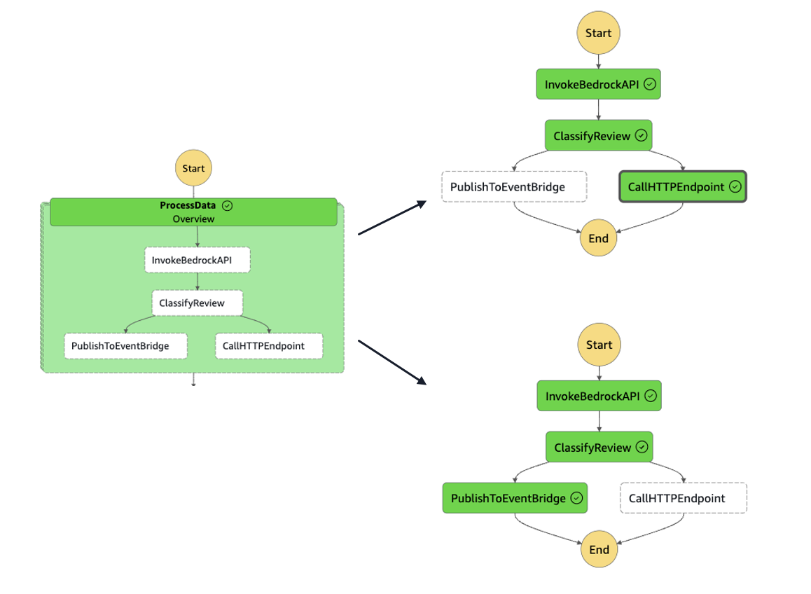

# ECS Private API with Shared Resource Pattern

This CDK project deploys a private ECS API service with ALB and VPC Lattice for shared resource access. The infrastructure is split into logical stacks for better maintainability and reuse.

## Architecture

The project creates the following AWS resources:

- VPC with public and private subnets
- ECS Fargate cluster
- ECS service with container task
- Internal Application Load Balancer
- Route53 DNS records
- VPC Lattice resource gateway for private API access
- RAM resource for cross account access
- An EventBridge connection to connect to the private API
- AWS Step Functions to handle the workflow and to connect to the private ECS resoruce. 

In this demo, we will build a sample application workflow that categorizes the user reviews as genuine or fake using the new Amazon Nova Micro model to enhace the User's shopping profiles.When a review is identified as fake, an event is published to EventBridge which can subsequently trigger actions on the associated user profile. Conversely if a review is classified as genuine, AWS Step Functions invokes a private HTTPS endpoint. For the purposes of this demo, a sample response is returned by the ECS backend. In real-world scenario, this endpoint could be utilized to assign promotions, award points, or add benefits to the user's profile. 



### Stack Structure

The infrastructure is divided into the following stacks:

1. **NetworkStack**: Base networking infrastructure
   - VPC
   - Public and private subnets
   - Internet Gateway
   - NAT Gateways

2. **ClusterStack**: ECS cluster configuration
   - ECS Fargate cluster
   - Cluster security group

3. **ServiceStack**: Application components
   - ECS service and task definition
   - Application Load Balancer
   - Security groups
   - Route53 records
   - ACM certificate integration

4. **VpcLatticeStack**: Shared resource configuration
   - VPC Lattice resource gateway
   - Resource configuration for private API access
   - RAM configuration for sharing the private endpoint with a secondary account

5. **WorkflowStack**: Demonstration application outside of VPC
   - Amazon EventBridge connection
   - AWS Step Functions workflow with Distributed Map

## Prerequisites

- Node.js 16.x or later
- AWS CDK CLI v2
- AWS credentials configured
- Docker or Finch (for building container images)
- Domain name managed by Route53
- ACM certificate for your domain

### Container Runtime
This project can use either Docker or Finch for building container images. Ensure you have one of these installed:
- Docker Desktop or Docker Engine
- Finch (docker-compatible container runtime)

## Setup

1. Clone the repository:
```bash
git clone <repository-url>
cd <project-directory>
```

2. Install dependencies:
```bash
npm install
```

3. Create a `.env` file
```
cp .env.example .env
```

4. Configure your environment variables in `.env`:
```
DOMAIN_NAME="<your domain name>"        # example mydomain.com
SUB_DOMAIN_NAME="<sub domain name>"     # sub domain for above domain 'ecs'
ACM_CERT_ARN="<ACM Cert Arn>"           # Cert arn for above subdomain 'https://ecs.mydomain.com'"
API_KEY="<API Key in app>"              # If you use demo app it is 1234567890
DEFAULT_ACCOUNT="<default account>"     # Primary account this is installed to
DEFAULT_REGION="<region>"               # Default region for primary account
SECONDARY_ACCOUNT="<secondary account>" # Account to share with via RAM
```

## Deployment

Deploy all stacks:
```bash
npm run deploy
```

Or deploy individual stacks:
```bash
npm run deploy:network
npm run deploy:cluster
npm run deploy:service
npm run deploy:lattice
npm run deploy:workflow
```

## Test the workflow:

Use the following JSON as an input to Step Functions. You can find the sample JSON in the test folder. 

```
{
  "items": 
    [
      {
        "asin": "B000F83SZQ",
        "helpful": [
          0,
          0
        ],
        "overall": 5,
        "reviewText": "I enjoy vintage books and movies so I enjoyed reading this book. The plot was unusual. Don't think killing someone in self-defense but leaving the scene and the body without notifying the police or hitting someone in the jaw to knock them out would wash today. Still it was a good read for me.",
        "reviewTime": "05 5, 2014",
        "reviewerID": "A1F6404F1VG29J",
        "reviewerName": "Avidreader",
        "summary": "Nice vintage story",
        "unixReviewTime": 1399248000
      },
      {
        "asin": "B000F83SZQ",
        "helpful": [
          2,
          2
        ],
        "overall": 4,
        "reviewText": "This book is a reissue of an old one; the author was born in 1910. It's of the era of, say, Nero Wolfe. The introduction was quite interesting, explaining who the author was and why he's been forgotten; I'd never heard of him. The language is a little dated at times, like calling a gun a 'heater.' I also made good use of my Fire's dictionary to look up words like 'deshabille' and 'Canarsie.' Still, it was well worth a look-see.",
        "reviewTime": "01 6, 2014",
        "reviewerID": "AN0N05A9LIJEQ",
        "reviewerName": "critters",
        "summary": "Different...",
        "unixReviewTime": 1388966400
      },
      {
        "asin": "B000F83SZQ",
        "helpful": [
          2,
          2
        ],
        "overall": 4,
        "reviewText": "This was a fairly interesting read. It had old-style terminology. I was glad to get to read a story that doesn't have coarse, crass language. I read for fun and relaxation... I like the free ebooks because I can check out a writer and decide if they are intriguing, innovative, and have enough of the command of English that they can convey the story without crude language.",
        "reviewTime": "04 4, 2014",
        "reviewerID": "A795DMNCJILA6",
        "reviewerName": "dot",
        "summary": "Oldie",
        "unixReviewTime": 1396569600
      },
      {
        "asin": "B000F83SZQ",
        "helpful": [
          1,
          1
        ],
        "overall": 5,
        "reviewText": "I'd never read any of the Amy Brewster mysteries until this one.. So I am really hooked on them now.",
        "reviewTime": "02 19, 2014",
        "reviewerID": "A1FV0SX13TWVXQ",
        "reviewerName": "Elaine H. Turley \"Montana Songbird\"",
        "summary": "I really liked it.",
        "unixReviewTime": 1392768000
      },
      {
        "asin": "B000F83SZQ",
        "helpful": [
          0,
          1
        ],
        "overall": 4,
        "reviewText": "If you like period pieces - clothing, lingo, you will enjoy this mystery. Author had me guessing at least 2/3 of the way through.",
        "reviewTime": "03 19, 2014",
        "reviewerID": "A3SPTOKDG7WBLN",
        "reviewerName": "Father Dowling Fan",
        "summary": "Period Mystery",
        "unixReviewTime": 1395187200
      },
      {
        "asin": "B000F83SZQ",
        "helpful": [
          0,
          0
        ],
        "overall": 4,
        "reviewText": "A beautiful in-depth character description makes it like a fast pacing movie. It is a pity Mr. Merwin did not write 30 instead only 3 of the Amy Brewster mysteries.",
        "reviewTime": "05 26, 2014",
        "reviewerID": "A1RK2OCZDSGC6R",
        "reviewerName": "ubavka seirovska",
        "summary": "Review",
        "unixReviewTime": 1401062400
      },
      {
        "asin": "B000F83SZQ",
        "helpful": [
          0,
          0
        ],
        "overall": 4,
        "reviewText": "I enjoyed this one tho I'm not sure why it's called An Amy Brewster Mystery as she's not in it very much. It was clean, well written and the characters well drawn.",
        "reviewTime": "06 10, 2014",
        "reviewerID": "A2HSAKHC3IBRE6",
        "reviewerName": "Wolfmist",
        "summary": "Nice old fashioned story",
        "unixReviewTime": 1402358400
      },
      {
        "asin": "B000F83SZQ",
        "helpful": [
          1,
          1
        ],
        "overall": 4,
        "reviewText": "Never heard of Amy Brewster. But I don't need to like Amy Brewster to like this book. Actually, Amy Brewster is a sidekick in this story, who added mystery to the story not the one resolved it. The story brings back the old times, simple life, simple people, and straight relationships.",
        "reviewTime": "03 22, 2014",
        "reviewerID": "A3DE6XGZ2EPADS",
        "reviewerName": "WPY",
        "summary": "Enjoyable reading and reminding the old times",
        "unixReviewTime": 1395446400
      },
      {
        "asin": "B000FA64PA",
        "helpful": [
          0,
          0
        ],
        "overall": 5,
        "reviewText": "Darth Maul working under cloak of darkness committing sabotage now that is a story worth reading many times over. Great story.",
        "reviewTime": "10 11, 2013",
        "reviewerID": "A1UG4Q4D3OAH3A",
        "reviewerName": "dsa",
        "summary": "Darth Maul",
        "unixReviewTime": 1381449600
      }
    ]
}

```


## Clean Up

To destroy all resources:
```bash
npm run destroy
```

## Project Structure

```
.
├── bin/
│   └── app.ts                  # Entry point
├── lib/
│   ├── network-stack.ts        # VPC and networking
│   ├── cluster-stack.ts        # ECS Cluster
│   ├── service-stack.ts        # Service and ALB
│   ├── vpclattice-stack.ts     # VPC Lattice configuration
│   └── workflow-stack.ts       # Workflow configuration
├── api-container/
│   └── Dockerfile             # API container definition
├── test/
│   └── sample_execution.json   # API container definition
├── .env                        # Environment variables
├── cdk.json                    # CDK configuration
└── package.json                # Project dependencies
```

## Available Scripts

- `npm run build`: Compile TypeScript code
- `npm run watch`: Watch for changes and compile
- `npm run test`: Run the test suite
- `npm run deploy`: Deploy all stacks
- `npm run deploy:network`: Deploy network stack
- `npm run deploy:cluster`: Deploy cluster stack
- `npm run deploy:service`: Deploy service stack
- `npm run deploy:lattice`: Deploy VPC Lattice stack
- `npm run deploy:workflow`: Deploy Workflow stack
- `npm run destroy`: Remove all deployed resources

## Security Considerations

- The Application Load Balancer is internal (not internet-facing)
- VPC endpoints are used for AWS services
- Security groups restrict access between components
- Container tasks run on Fargate with minimum required permissions
- Private subnets are used for the ECS tasks
- VPC Lattice provides secure service access for consumers
- Route 53 is configured with public hosted zones, while the subdomain name resolves to a private IP address, enhancing security and network isolation.  


## Troubleshooting

1. **VPC Lookup Issues**
   - Ensure your AWS credentials are configured correctly
   - Check if you're in the correct AWS region
   - Verify VPC exists if using existing VPC

2. **Container Build and Health Check Issues**
   - If using Finch, ensure the service is running (`finch vm start`)
   - Verify container health check endpoint is responding
   - Check container logs in CloudWatch
   - Ensure security groups allow health check traffic
   - For Finch users: use `finch build` to test container builds locally

3. **DNS Resolution Issues**
   - Verify Route53 hosted zone exists
   - Check ACM certificate is valid and in the correct region
   - Ensure DNS records are properly propagated

4. **Bedrock Issues**
   - If you are getting Model access issues. Go to the "Amazon Bedrock" service > Model Access > Modify Model Access and request the Amazon Nova Micro model. 
   - Check if [Amazon Nova](https://docs.aws.amazon.com/bedrock/latest/userguide/models-regions.html)  is available in the region you are deploying the stack.
   